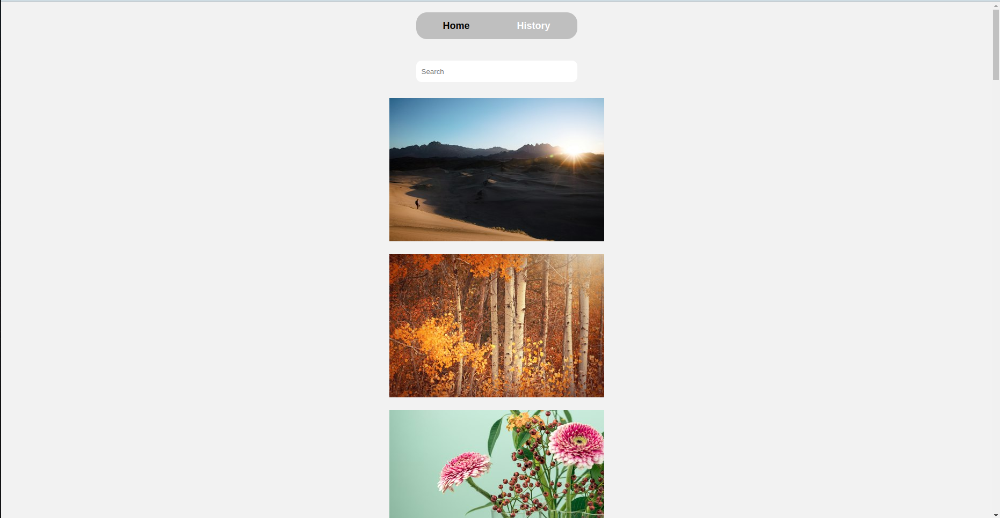

## Table of contents

- [Overview](#overview)
  - [The challenge](#the-challenge)
  - [Screenshot](#screenshot)
  - [Links](#links)
- [My process](#my-process)
  - [Built with](#built-with)
  - [What I learned](#what-i-learned)
- [Author](#author)

### Screenshot

### Links

- Live Site URL: [https://photo-gallery-wine.vercel.app/]

## My process

### Built with

- Semantic HTML5 markup
- CSS custom properties
- Flexbox
- Mobile-first workflow
- Zustand
- [React](https://reactjs.org/) - JS library
- [Styled Components](https://styled-components.com/) - For styles

### What I learned

this React project centers around a dynamic photo gallery feature. the primary functionalities include fetching photos from a designated gallery and displaying them on the page. moreover, the implementation incorporates an infinite scroll feature, ensuring a seamless experience for users. upon reaching the end of the page, an additional set of 20 photos are dynamically loaded, allowing continuous browsing.i am proficient in fetching and dynamically displaying data within a React application. i have mastered react's advanced features such as infinite scroll implementation and dynamic filtering functionality. furthermore, i possess a strong understanding of effective state management techniques using Zustand, which enhances the scalability and maintainability of the application. additionally, i have acquired skills in API integration to fetch and display detailed insights for individual photo items, contributing to a more engaging user experience.

## Author

- Github - [achiewe](https://github.com/achiewe)
- LinkedIn - [achi mamukashvili](https://www.linkedin.com/in/achi-mamukashvili-721928263/)
